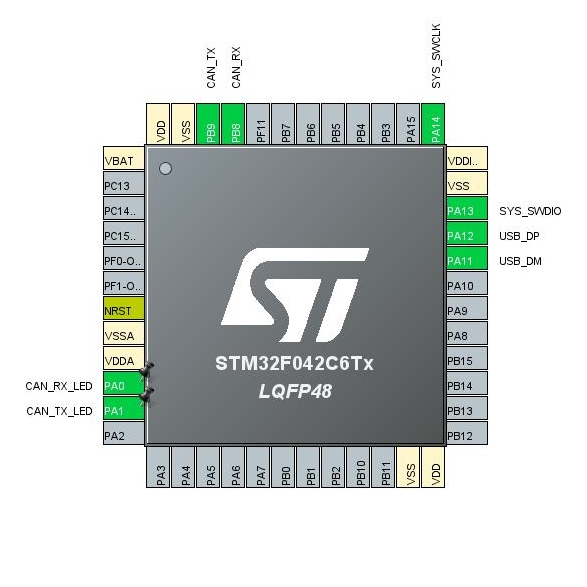

# PEAK PCAN firmware for STM32F042C6T6(STM32F072C8T6) based boards 

## :dart: 目标硬件 / Target Hardware

- [CANtact](https://github.com/linklayer/cantact-hw) - opensource USB-CAN adapter project `make cantact_16`
- [CANable](https://canable.io/) - opensource USB-CAN adapter based on CANtact project `make canable`
- [Entreé](https://github.com/tuna-f1sh/entree) - opensource USB-C CAN adapter based on CANable project `make entree`
- [Ollie](https://github.com/slimelec/ollie-hw) - opensource USB-CAN adapter with isolated USB `make ollie`
- Any other STM32F042C6T6(STM32F072C8T6) based boards with external or internal OSC.

<table>
<tr>
<td style = "width: 80%;">

</td>
<td style = "width: 20%;">

| PINs | FUNCTIONs  |
|-----:|------------|
| PA0  | CAN_RX_LED |
| PA1  | CAN_TX_LED |
| PB8  | CAN_RX     |
| PB9  | CAN_TX     |
| PA11 | USB_DM     |
| PA12 | USB_DP     |

</td>
</tr>
</table>

## :wrench: 工具链 / Toolchain

- GNU Arm Embedded Toolchain

## :beers: 鸣谢 / Credits & Special Thanks

> 支持原作者 Support original author [@Moonglow][Moonglow]

- <a href="https://www.patreon.com/bePatron?u=58145249" data-patreon-widget-type="become-patron-button">Become a Patron!</a>
- **Bitcoin (P2WPKH):** bc1qstnsjqu2kw9v2axens54ycegn3stwvluq7ze5j

## :star: License

----

WTFPL

[Moonglow]: https://github.com/moonglow
